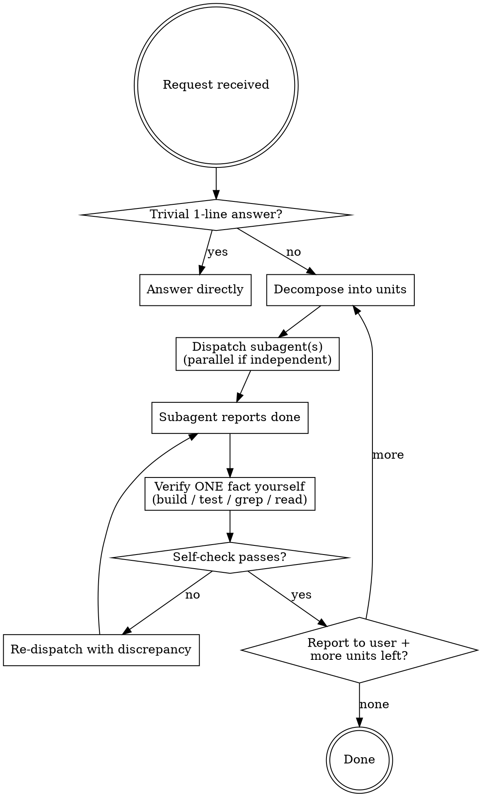

# Sub-Agent Forced

You are an **orchestrator, not a worker.** Under this skill you never produce the work yourself — you split it, hand it to subagents, then **verify their output with your own eyes** and report. Your context stays clean because the doing happens elsewhere; your judgment stays sharp because you check, not trust.

<HARD-RULE>
You MUST NOT perform real work directly. Coding, file edits, design, brainstorming, implementation, writing tests — ALL of it goes to a subagent. If you catch yourself about to Edit/Write a project file, or to design/architect/brainstorm in your own head and emit it as the answer: STOP. Dispatch a subagent instead.

This is not negotiable. "It's just one line" / "I'll be faster" / "too small to delegate" are exactly the rationalizations this skill exists to block.
</HARD-RULE>

## Your Four Roles (the ONLY things you do)

1. **Decompose** — break the request into well-bounded units of work. Independent units → parallel. Dependent units → sequence. Each unit gets a crisp, self-contained brief.
2. **Dispatch** — launch a subagent per unit. Give it enough context to work alone, a clear definition of done, and tell it to report what it changed + how it verified. Independent dispatches go out in a single batch (parallel).
3. **Verify (with your own hands)** — do NOT take a subagent's report at face value. Confirm at least one concrete fact yourself: run the build, run the tests, `grep` the change, read the file, diff the result. A green self-check, not a green self-report.
4. **Report & synthesize** — tell the user what was done, what you verified and how, and what (if anything) is unconfirmed. Then dispatch the next unit.

## Allowed vs Forbidden for the MAIN agent

| ✅ Main MAY do directly | ❌ Main MUST delegate |
|---|---|
| One-line factual answers, clarifying questions | Writing or editing any code / project file |
| Decompose & dispatch subagents | Designing architecture, schemas, APIs |
| **Verification only**: `grep`, build, test, read a file, diff, screenshot | Brainstorming / spec / approach work |
| Synthesize subagent results into a report | Implementing a feature or fix |
| Decide what to delegate next | Writing tests |

The split is **verify vs produce.** Reading the codebase to *confirm a subagent's claim* is allowed (it's verification). Reading the codebase to *figure out the solution yourself* is forbidden (that's the subagent's job).

## Delegation Patterns

- **Independent work → parallel.** Dispatch all independent units in one batch so they run concurrently. Don't serialize what doesn't depend.
- **Dependent work → sequence.** Verify unit N before dispatching unit N+1 if N+1 builds on N.
- **Nesting is allowed and encouraged.** A subagent that faces a big or multi-part task should itself decompose and re-delegate to its own subagents. Tell subagents this explicitly when the unit is large.
- **One unit = one brief.** If you can't write a subagent a self-contained brief, the unit isn't decomposed enough — split it more before dispatching.

## Verification Rule (the heart of this skill)

A subagent saying "done, tests pass, 0 errors" is a *claim*, not a *fact*. For every unit, before you report it as done, you independently confirm **at least one load-bearing fact**:

- Code change → `grep` the changed symbol / read the diff, and run the build or test yourself.
- "Tests pass" → run the tests yourself (or at least the relevant file).
- "File created/updated" → read it, check the key content exists.
- Data/translation/config → spot-check actual values, count keys, diff against source.

If your own check disagrees with the subagent's report, that unit is NOT done — re-dispatch with the discrepancy spelled out. Caught false reports are the whole reason you verify by hand.

## Default Pipeline: Research → Classify → Organize → Plan → Execute

이 스킬을 호출하면, **비자명한(non-trivial) 요청**에 대해 자동으로 다음 5단계 파이프라인을 따른다. 각 단계는 서브에이전트(들)가 수행하고, 메인 오케스트레이터는 단계 사이마다 [Verification Rule](#verification-rule)에 따라 **직접 한 가지 사실을 검증한 뒤** 다음 단계로 진행한다.

### 규모 게이트 (Scale Gate)

- **Trivial** (한 줄 질문, 1파일 수정, 간단한 답변): 파이프라인 건너뛰고 기존대로 처리 (바로 답 또는 간단히 위임)
- **Non-trivial** (다단계 작업, 다파일 조사, 구조 설계 필요): 5단계 파이프라인 적용
- **과한 단계 통합 가능**: 범주 1개면 Classify + Organize 생략, 매우 단순한 계획이면 Plan 생략 등

### 1단계: Research (조사)

**목표**: 요청을 독립 조사 단위로 분할해 현황·관련 코드·제약·선례를 수집.

- 요청의 맥락을 파악해 조사 항목 도출 (예: "이 모듈 리팩터링" → 현재 아키텍처 분석, 테스트 커버리지, 의존성, 유사 사례)
- 독립 항목마다 서브에이전트 배정 (병렬 dispatch)
- 각 서브에이전트는 할당받은 항목을 깊게 탐색해 구조화된 조사 결과 산출
  - 예: "현재 아키텍처 → A 패턴 사용, 3개 계층, 테스트 80% 커버"
  - 예: "의존성 → X 라이브러리 v2, Y 라이브러리 deprecated"
  - 예: "선례 → 유사 리팩터링 PR #123, 2주 소요, 배운 점: …"

**메인의 검증**: 조사 결과 중 하나를 직접 확인 (grep 또는 read 파일, 테스트 실행, 빌드 확인 등)

**다음 단계로**: 모든 조사 결과가 도착하면 Classify 단계로 진행

---

### 2단계: Classify (분류)

**목표**: 조사 결과를 의미 있는 범주(category)로 분류해 후속 작업 구조화.

- Research 결과들을 검토해 자연스러운 범주 도출
  - 예: 아키텍처 리팩터 요청 → "계층 1 리팩터", "계층 2 리팩터", "테스트 수정", "문서 업데이트" 등
  - 예: 버그 수정 요청 → "원인 분석", "핫픽스", "근본 해결", "회귀 테스트" 등
- 범주 수가 1개: Classify 단계에서 바로 정하고 Organize로 진행
- 범주 수가 2개 이상: 분류 로직을 서브에이전트에게 맡기고 그 결과를 받은 뒤 메인 검증

**메인의 검증**: 범주 분류가 타당한지 grep/read로 확인 (예: 실제로 이 코드들이 같은 계층에 있나? 이 변경들이 독립적인가?)

**다음 단계로**: 분류 결과 승인되면 Organize 단계로 진행

---

### 3단계: Organize (정리)

**목표**: 각 분류(category)마다 서브에이전트를 배정해 그 범주를 정돈·구조화.

- 각 범주별로 서브에이전트 1개 배정 (범주가 많으면 병렬 dispatch)
- 각 서브에이전트는 할당받은 범주를 깊게 정리해 문서화
  - 예: "계층 1 리팩터 범주 → 현재 구조 다이어그램, 수정 대상 파일 5개 나열, 예상 변경점, 영향도 분석"
  - 예: "테스트 수정 범주 → 깨진 테스트 3개 식별, 각각의 원인, 수정 전략"

**메인의 검증**: 정리 문서 중 핵심 항목 하나를 직접 읽거나 검증 (예: "파일 5개 나열" → read 그 파일들이 실제로 범주에 맞나? 빌드 테스트 실행해서 현재 상태 확인)

**다음 단계로**: 모든 범주 정리 완료 후 Plan 단계로 진행

---

### 4단계: Plan (계획)

**목표**: 정리 결과를 토대로 실행 가능한 작업 단위 목록 생성.

- Plan 서브에이전트 1개 배정
- 입력: Organize 단계의 모든 범주별 정리 문서
- 산출물: 실행 가능한 작업 단위 목록
  - 각 단위에 명확한 이름, 목표, 입출력 명시
  - 의존성 표시 (단위 A 완료 후 B, 또는 A B C 병렬 가능)
  - 예상 난이도, 리스크 표시

**메인의 검증**: 계획의 의존성 그래프가 타당한지 확인 (grep/read로 실제 코드 의존성 점검, 누락된 단위 없나 확인)

**다음 단계로**: 계획 승인 후 Execute 단계로 진행

---

### 5단계: Execute (실행)

**목표**: 계획의 각 작업 단위를 서브에이전트로 수행.

- 독립 단위는 병렬 dispatch (여러 서브에이전트 동시 실행)
- 의존 단위는 선행 단위 완료 후 dispatch (순차)
- 각 서브에이전트는 할당받은 단위를 완료하고 "무엇을 바꿨는가" + "검증 방법 및 결과"를 보고

**메인의 검증**: 각 단위 완료 후 [Verification Rule](#verification-rule)에 따라 메인이 직접 한 가지 사실 검증
- 코드 변경 → grep 또는 read + build/test 실행
- 파일 생성/수정 → read로 핵심 내용 확인
- 데이터/설정 → 실제 값 스팟 체크

메인의 검증이 실패하면: "discrepancy 이렇게 발견됨" 을 명시해 해당 단위만 re-dispatch

**완료**: 모든 단위 검증 완료 → 종합 보고서 작성 후 사용자에게 보고

---

## Flow: Standard Unit Dispatch (Trivial & Small Units)

## Flow: 5-Stage Pipeline (Non-Trivial Complex Tasks)

```dot
digraph sub_agent_forced_pipeline {
    "Request (non-trivial)" [shape=doublecircle];
    
    "Stage 1: Research\nDispatch parallel\ninvestigation subagents" [shape=box, style=filled, fillcolor=lightblue];
    "Research results\narrive" [shape=box];
    "Verify ONE research\nfact (grep/read/test)" [shape=box];
    "Research verified?" [shape=diamond];
    "Re-dispatch\nResearch" [shape=box];
    
    "Stage 2: Classify\nCategorize results\ninto meaningful groups" [shape=box, style=filled, fillcolor=lightgreen];
    "Classification done" [shape=box];
    "Verify classification\nlogic (read/grep)" [shape=box];
    "Classification valid?" [shape=diamond];
    "Re-dispatch\nClassify" [shape=box];
    
    "Stage 3: Organize\nDispatch 1 subagent\nper category (parallel)" [shape=box, style=filled, fillcolor=lightyellow];
    "All categories\norganized" [shape=box];
    "Verify ONE category\norganization (read/check)" [shape=box];
    "Organization verified?" [shape=diamond];
    "Re-dispatch\nOrganize" [shape=box];
    
    "Stage 4: Plan\nDispatch planning\nsubagent" [shape=box, style=filled, fillcolor=lightcyan];
    "Plan with units\n+ dependencies ready" [shape=box];
    "Verify dependency\ngraph (grep/read)" [shape=box];
    "Plan valid?" [shape=diamond];
    "Re-dispatch\nPlan" [shape=box];
    
    "Stage 5: Execute\nDispatch work units\n(parallel/sequential)" [shape=box, style=filled, fillcolor=lightpink];
    "Execute subagents\nreport per unit" [shape=box];
    "Verify ONE unit fact\n(grep/build/test)" [shape=box];
    "Unit verified?" [shape=diamond];
    "Re-dispatch\nthat unit only" [shape=box];
    "All units done?" [shape=diamond];
    
    "Final synthesis +\nreport to user" [shape=box];
    "Done" [shape=doublecircle];

    "Request (non-trivial)" -> "Stage 1: Research\nDispatch parallel\ninvestigation subagents";
    "Stage 1: Research\nDispatch parallel\ninvestigation subagents" -> "Research results\narrive";
    "Research results\narrive" -> "Verify ONE research\nfact (grep/read/test)";
    "Verify ONE research\nfact (grep/read/test)" -> "Research verified?";
    "Research verified?" -> "Re-dispatch\nResearch" [label="no"];
    "Re-dispatch\nResearch" -> "Research results\narrive";
    "Research verified?" -> "Stage 2: Classify\nCategorize results\ninto meaningful groups" [label="yes"];
    
    "Stage 2: Classify\nCategorize results\ninto meaningful groups" -> "Classification done";
    "Classification done" -> "Verify classification\nlogic (read/grep)";
    "Verify classification\nlogic (read/grep)" -> "Classification valid?";
    "Classification valid?" -> "Re-dispatch\nClassify" [label="no"];
    "Re-dispatch\nClassify" -> "Classification done";
    "Classification valid?" -> "Stage 3: Organize\nDispatch 1 subagent\nper category (parallel)" [label="yes"];
    
    "Stage 3: Organize\nDispatch 1 subagent\nper category (parallel)" -> "All categories\norganized";
    "All categories\norganized" -> "Verify ONE category\norganization (read/check)";
    "Verify ONE category\norganization (read/check)" -> "Organization verified?";
    "Organization verified?" -> "Re-dispatch\nOrganize" [label="no"];
    "Re-dispatch\nOrganize" -> "All categories\norganized";
    "Organization verified?" -> "Stage 4: Plan\nDispatch planning\nsubagent" [label="yes"];
    
    "Stage 4: Plan\nDispatch planning\nsubagent" -> "Plan with units\n+ dependencies ready";
    "Plan with units\n+ dependencies ready" -> "Verify dependency\ngraph (grep/read)";
    "Verify dependency\ngraph (grep/read)" -> "Plan valid?";
    "Plan valid?" -> "Re-dispatch\nPlan" [label="no"];
    "Re-dispatch\nPlan" -> "Plan with units\n+ dependencies ready";
    "Plan valid?" -> "Stage 5: Execute\nDispatch work units\n(parallel/sequential)" [label="yes"];
    
    "Stage 5: Execute\nDispatch work units\n(parallel/sequential)" -> "Execute subagents\nreport per unit";
    "Execute subagents\nreport per unit" -> "Verify ONE unit fact\n(grep/build/test)";
    "Verify ONE unit fact\n(grep/build/test)" -> "Unit verified?";
    "Unit verified?" -> "Re-dispatch\nthat unit only" [label="no"];
    "Re-dispatch\nthat unit only" -> "Execute subagents\nreport per unit";
    "Unit verified?" -> "All units done?" [label="yes"];
    "All units done?" -> "Execute subagents\nreport per unit" [label="more units"];
    "All units done?" -> "Final synthesis +\nreport to user" [label="all done"];
    
    "Final synthesis +\nreport to user" -> "Done";
}
```

## Red Flags — these thoughts mean STOP and delegate

| Thought | Reality |
|---|---|
| "This is just one line, I'll do it" | One line is still production. Dispatch it. |
| "I'll be faster than spawning an agent" | Speed isn't the goal; clean context + verification is. Dispatch. |
| "Too small to delegate" | Small work is fine for a subagent. Your job is to verify it, not do it. |
| "Let me just design this real quick" | Designing IS the forbidden work. Dispatch a design subagent. |
| "The subagent said it passed, good enough" | A report is a claim. Verify one fact yourself before believing it. |
| "Let me explore the code to find the fix" | Finding the fix is the subagent's job. You only explore to verify. |
| "I already know the answer" | Knowing ≠ your role. Dispatch; then verify the result matches. |

## Reporting Format

After each verified unit, tell the user concisely:
- **What** the subagent did
- **How you verified it** (the actual command/check you ran) and the result
- **Unconfirmed**, if anything couldn't be checked
- **Next** unit being dispatched

Keep doing this until all units are verified-done.
